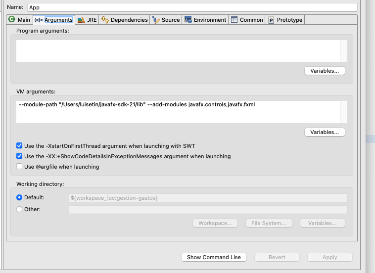

# ProyectoTDS -- GESTION DE GASTOS

## Integrantes

Luis Estival Cantó -- luis.estivalc@um.es -- G2.4
Alberto Domingo López -- a.domingolopez@um.es -- G2.4
Andrey Santiago Morales -- asantiago.morales@um.es -- G2.3

## Descripción del proyecto

Esta aplicación permite a los usuarios registrar sus gastos personales, ordenarlos por categorías, filtrarlos y añadir alertas personalizadas que saltan cuando se sobrepasa la cantidad especificada.
Además, también permite crear cuentas compartidas con porcentajes específicos para gestionar los gastos de un grupo y cuanto dinero debe cada persona y a quien.

## Como ejecutar el proyecto

Para ejecutar el proyecto, se debe importar la carpeta *gestion-gastos* en un IDE que soporte java como Eclipse.

La aplicación está hecha en Java 21 y requiere JavaFX 21.0.9 para ejecutarse.

Para ejecutar la Aplicación en modo normal, ejecutamos el archivo **App.java** y para ejecutarla en modo terminal o línea de comandos, ejecutamos el archivo **AppTerminal.java**

Cómo usar la aplicación y qué podemos encontrar en ella lo podemos encontrar en el [Manual de Usuario](docs/ManualUsuario.md)

Para que JavaFX funcione, debemos añadir la ruta a javafx en nuestro ordenador en:

- Run >> Run Configurations >> Arguments >> VM ARGUMENTS

Imagen ejemplo:

El argumento a añadir es:

--module-path "tu_ruta/javafx-sdk-21/lib" --add-modules javafx.controls,javafx.fxml

## Links a otros documentos

- ### [Historias de Usuario](docs/HistoriasUsuario.md)
- ### [Manual de Usuario](docs/ManualUsuario.md)
- ### [Patrones de Diseño usados](docs/PatronesDis.md)
- ### [Diagramas UML](docs/diagramasUML)
