# MANUAL DE USUARIO

## Introducción
Esta aplicación permite a los usuarios registrar sus gastos personales, ordenarlos por categorías, filtrarlos y añadir alertas personalizadas que saltan cuando se sobrepasa la cantidad especificada.
Además, también permite crear cuentas compartidas con porcentajes específicos para gestionar los gastos de un grupo y cuanto dinero debe cada persona y a quien.

La aplicación está hecha en Java 21 y requiere JavaFX 21.0.9 para ejecutarse.

## 1 Ventana de Inicio

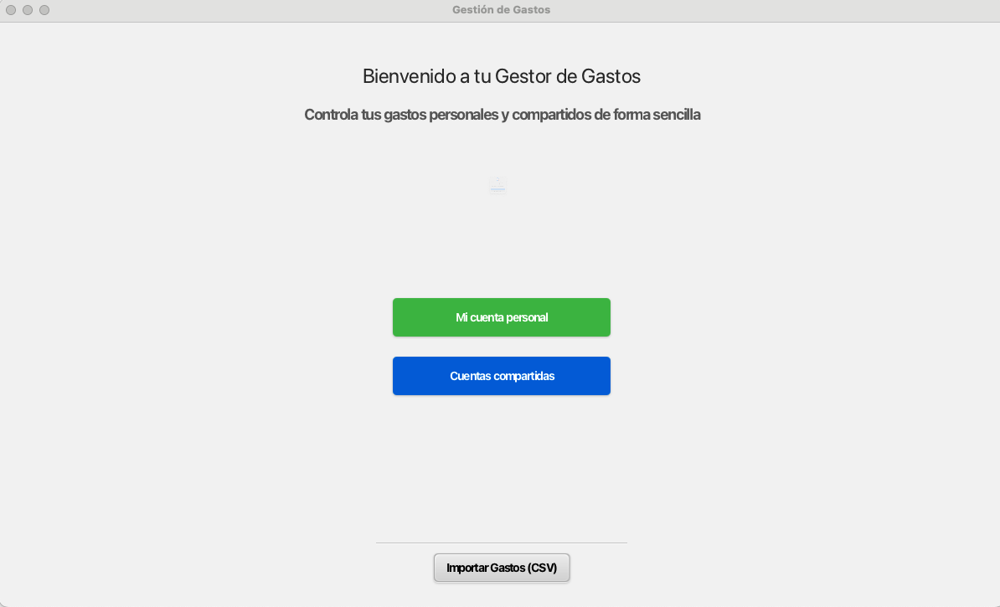

Esta es la ventana principal de la aplicación. Desde aquí podemos navegar a la sección de Cuenta Personal y Cuentas Compartidas ( explicadas más adelante )

En la parte inferior tenemos un botón para importar datos a la aplicación en formato .csv
El formato del archivo csv está explicado en la sección <Importacion>

## 2 Ventana de Gastos Personales

### Mis Gastos

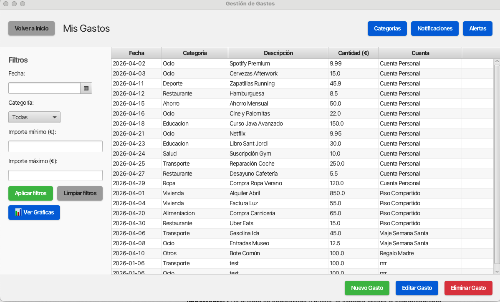

En esta venana podemos ver todos los gastos que hemos hecho, tanto en nuestra cuenta personal, como en las cuentas compartidas en las que participemos.

Los gastos muestran la fecha, categoría, decripción, cantidad en euros y la cuenta en la que se realizó el gasto. Podemos filtrar sobre todos estos campos en la parte izquierda de la ventana, pulsando <Aplicar filtros> y podemos limpiar los filtros pulsando <Limpiar Filtros>.

Continuando por la izquierda, podemos pulsar <Ver Graficas> para visualizar las estadísticas sobre nuestros gastos:

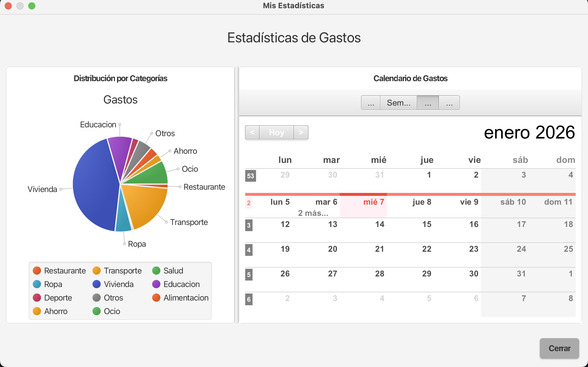

### Gestionar gastos

En la parte de abajo a la derecha podemos ver 3 botones.

- Nuevo gasto permite crear un nuevo gasto en cualquiera de las cuentas en las que participa el usuario.
- Editar gasto permite editar un gasto seleccionado, cambiando cualquier valor que se necesite.
- Eliminar gasto permite borrar un gasto de los listados tras seleccionarlo, pulsar el botón y confirmar el borrado.

Imágenes de las 3 interfaces:

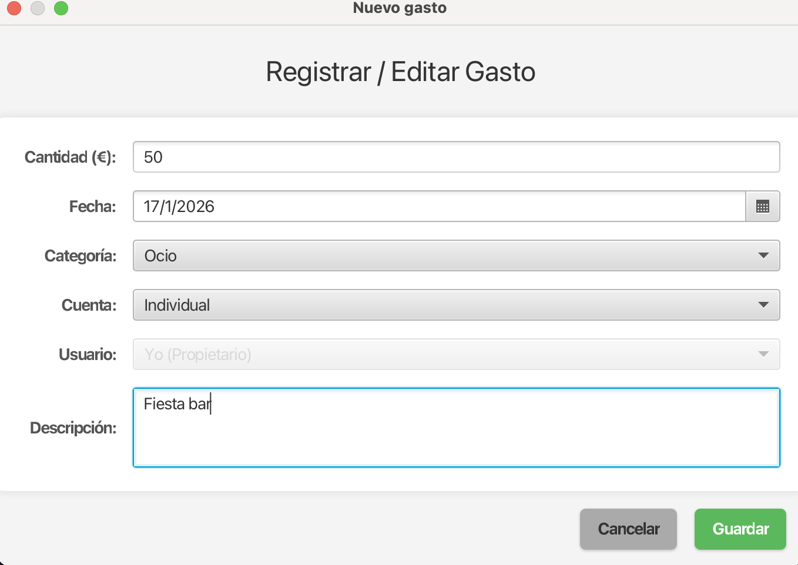
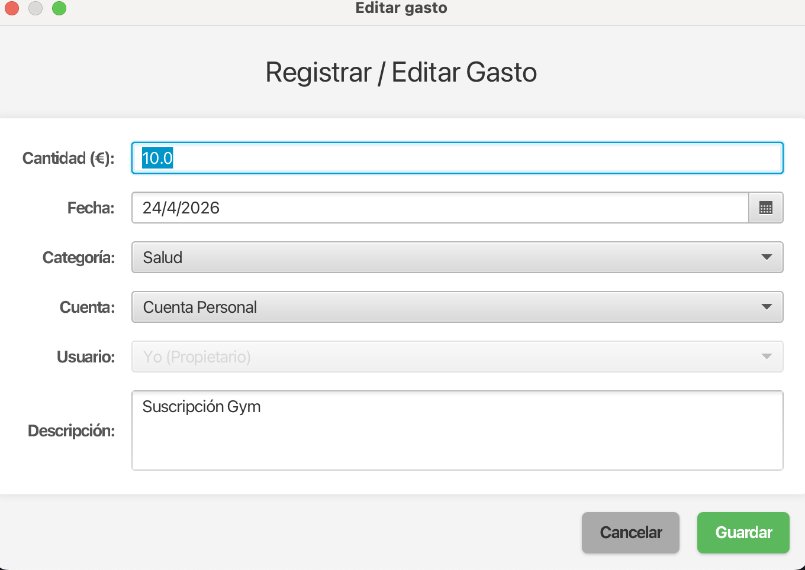
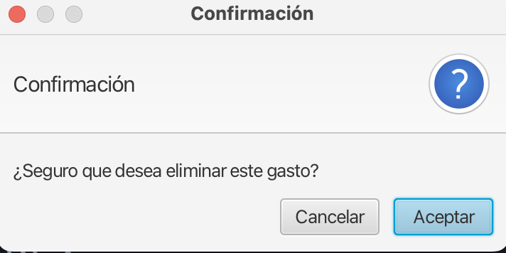

Cualquier campo puede ser cambiado en el formulario, excepto Usuario, que permanece intacto ya que en esta sección solo podemos añadir gastos propios.

### Adicionales

Continuando por la parte superior tenemos 3 botones más:

- Categorias: permite el listado, creación y borrado de categorías.
- Notificaciones: contiene las notificaciones recibidas.
- Alertas: permite crear, desactivar y borrar alertas.

Imágenes:

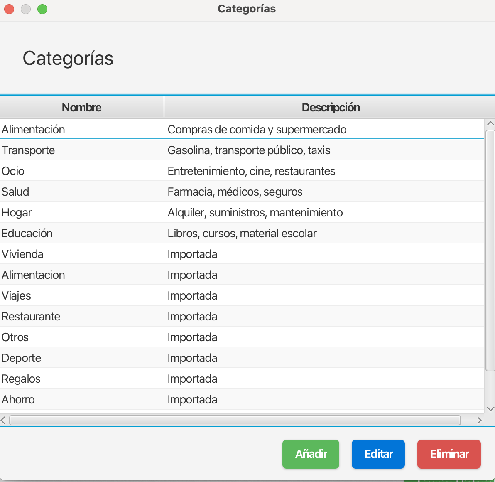
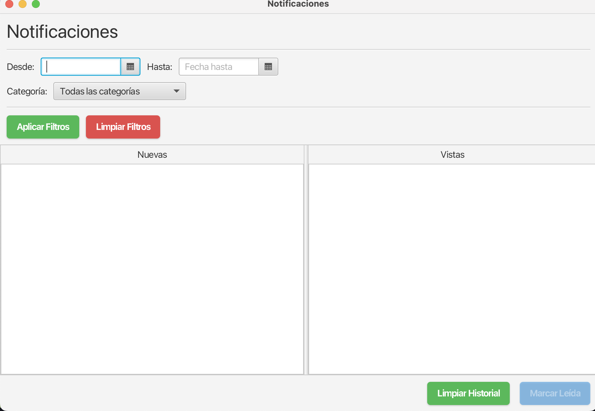
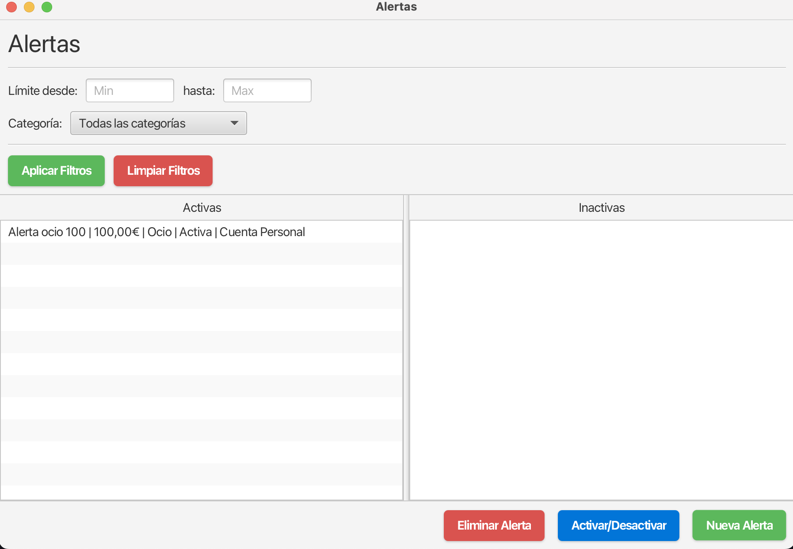

Tanto las notificaciones como las alertas pueden filtrarse por fecha y/o por categorías.

En el caso de las notificaciones, podemos marcarlas como leídas y, en el caso de las alertas, como activas o inactivas.

## 3 Ventana de Gastos Compartidos

### Mis cuentas compartidos
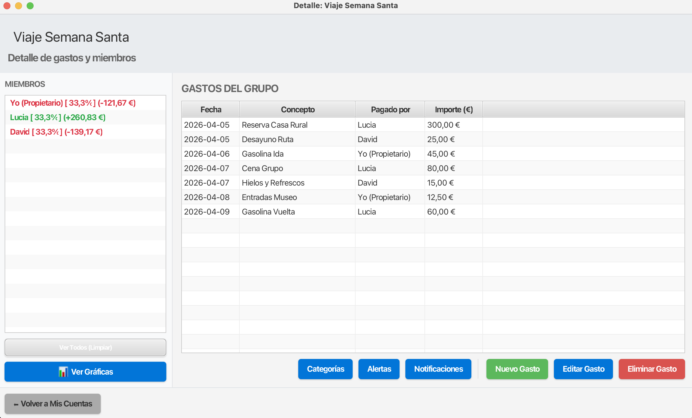

En la pestaña de 'Cuentas Compartidas' podemos ver una primera sección en la que gestionar dichas cuentas.

Podemos crear y borrar cuentas sin problema mediante el mismo mecanismo que usabamos para crear y borrar gastos.

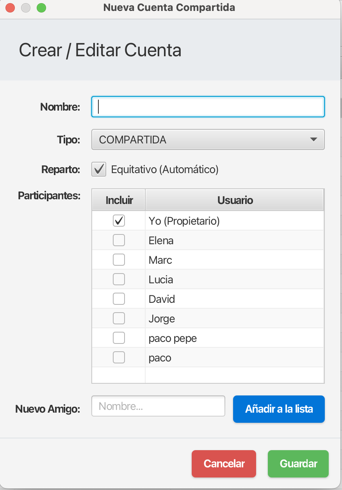

Al crear una nueva cuenta, se deben marcar los usuarios que participan ( si ya han participado antes ) o añadirlos como 'nuevos amigos' y luego marcarlos si es la primera vez.

Además, hay una casilla de cuenta equitativa que podemos marcar o desmarcar en función de si queremos un reparto igualitario o personalizado.

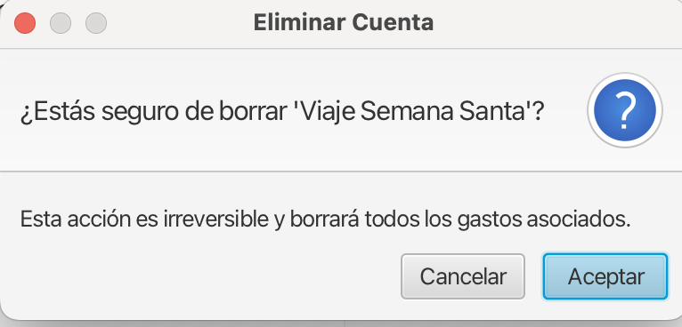

Además, podemos entrar a una cuenta haciendo doble click o pulsando en 'Entrar en Cuenta'

### Detalles de una cuenta

Una vez dentro de una cuenta en específico, esta sería la vista:

En el lado izquiedo podemos ver una lista con los Miembros de la cuenta compartida.
Se mostrará el nombre, el **porcentaje** de aportación y la **deuda** de cada uno.

- Porcentaje: cuánto debe aportar cada persona a cada gasto (1-100%)
- Deuda: cuánto dinero debe cada uno ( puede ser positiva si te deben o negativa si debes )

En el centro tenemos la tabla con la fecha, concepto, pagador y importe del gasto.

En la parte de abajo tenemos de nuevo Categorias, Alertas y Notificaciones, que hacen lo mismo que en la Cuenta personal.

Los botones nuevo gasto, editar gasto y borrar gasto tienen también el mismo comportamiento.
La única diferencia es que el formulario te permite seleccionar la persona que realiza ese pago y, en base a eso, se calculan las deudas.

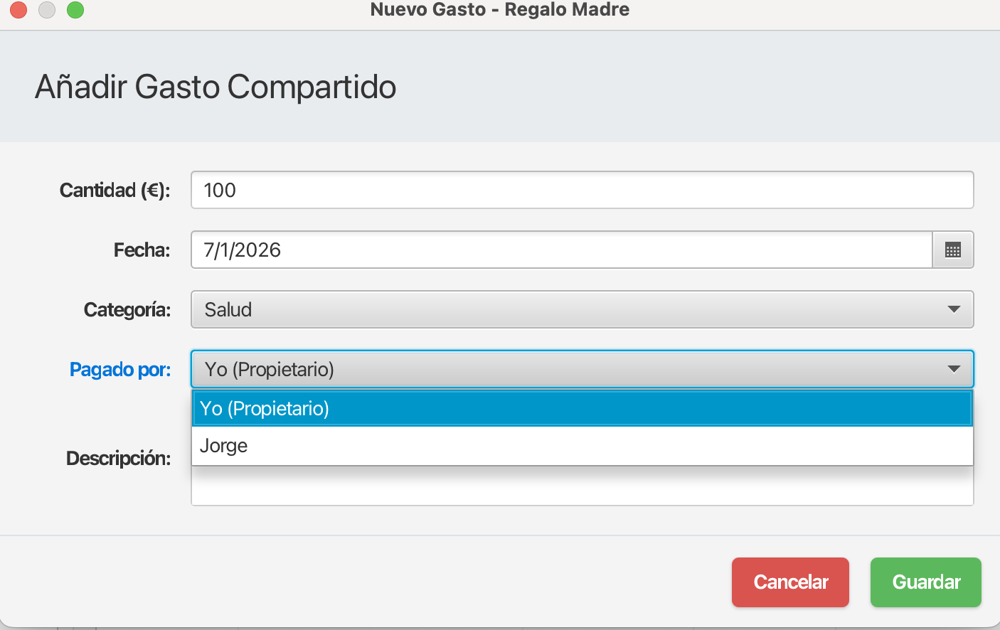

Finalmente, también podemos ver las estadísticas de la cuenta compartida que contiene un diagrama circular en gase a las categorías y una gráfica de barras para mostrar quien ha gastado más o menos.

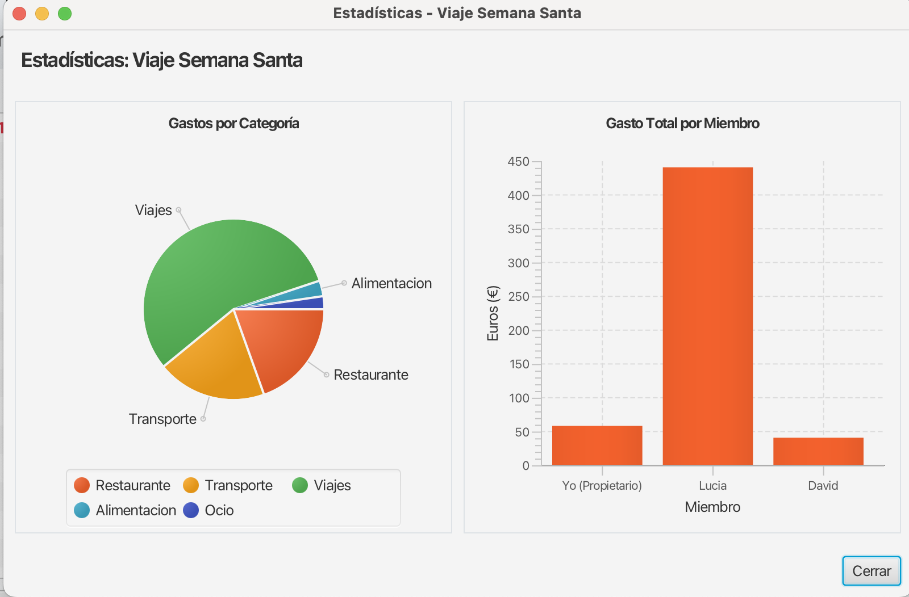

## 4 Importacion de datos

Para importar datos, debemos simplemente seleccionar un csv tras clickar el boton <Importar Datos>

El formato del csv debe ser el siguiente:

**fecha;cantidad;descripcion;categoria;cuenta;es_compartida;usuario_pagador**

Fecha: formato YYYY-MM-DD
Categoria: existente o no ( si no existe en la app se creará )
Cuenta: igual que categoría
Es_compartida: true o false ( si es false se añade a la cuenta personal)
Usuario_pagador: el nombre del pagador ( SOLO NECESARIO SI ES_COMPARTIDA=TRUE)

Ejemplo csv válido para utilizar:

FECHA	CANTIDAD	DESCRIPCION	CATEGORIA	CUENTA	ES_COMPARTIDA	USUARIO_PAGADOR
2026-04-01	850.00	Alquiler Abril	Vivienda	Piso Compartido	true	Yo
2026-04-01	40.00	Internet Fibra	Vivienda	Piso Compartido	true	Elena
2026-04-02	120.50	Compra Mensual Super	Alimentacion	Piso Compartido	true	Marc
2026-04-02	9.99	Spotify Premium	Ocio	Mi Cuenta Personal	false	
2026-04-03	15.00	Cervezas Afterwork	Ocio	Mi Cuenta Personal	false	
2026-04-04	55.00	Factura Luz	Vivienda	Piso Compartido	true	Yo
2026-04-05	300.00	Reserva Casa Rural	Viajes	Viaje Semana Santa	true	Lucia
2026-04-05	25.00	Desayuno Ruta	Restaurante	Viaje Semana Santa	true	David

En la carpeta csv/ dejamos un nuevos.csv para poder probar la importación.